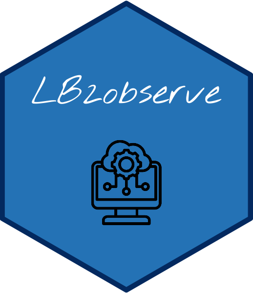

# LTO-WebApp

<div align="left" style="position: relative;">

</div>


The LTO web application is designed to make it easier to transfer logbooks relating to data on pelagic species collected as part of the OB7 observatory. It includes functions for importing and check validity data.


Built with the tools and technologies:


##  Table of Contents

- [ Overview](#-overview)
- [ Features](#-features)
- [ Getting Started](#-getting-started)
  - [ Prerequisites](#-prerequisites)
  - [ Installation](#-installation)
  - [ Usage](#-usage)
- [ Documentation](#-documentation)
- [ Contributing](#-contributing)
- [ License](#-license)
- [ Acknowledgments](#-acknowledgments)

---

##  Overview

The **LTO** web application is designed to facilitate the data transfert of logbooks related to pelagic species data collected as part of the OB7 observatory, to the [Observe](https://observe.ob7.ird.fr) application. 
The sourcing files can be logbooks, observations files or ERS data. 

For now, the app is developed for the purseiners' and longliners' logbooks. 

---

##  Features

- **Data Import:** Upload and manage logbooks from fishing campaigns.
- **Check validity:** Check the compatibility of the documents.
- **Metier:** Manage the french purseiners and seychellois longliners.

---
##  Getting Started

###  Prerequisites

Before getting started with lto-webapp, ensure your runtime environment meets the following requirements:

- **Programming Language:** Python
- **Package Manager:** Pip
- **Container Runtime:** Docker


###  Installation

Install lto-webapp using one of the following methods:

**Build from source:**

1. Clone the `lto-webapp` repository:
```sh
❯ git clone https://github.com/OB7-IRD/lto-webapp
```

2. Navigate to the project directory:
```sh
❯ cd lto-webapp
```

3. Install the project dependencies:


**Using `pip`** &nbsp; [](https://pypi.org/project/pip/)

```sh
❯ pip install -r requirements.txt
```

###  Usage
Run lto-webapp using the following command:

```sh
❯ python manage.py runserver
```

Then access the application in your browser at [http://localhost:8000](http://localhost:8000).

---

##  Documentation

Project documentation is available online: <https://ob7-ird.github.io/lto-webapp/>

---

##  Contributing

- **🐛 [Report Issues](https://github.com/OB7-IRD/lto-webapp/issues)**: Submit bugs found or log feature requests for the `lto-webapp` project.

<details closed>
<summary>Contributing Guidelines</summary>

1. **Fork the Repository**: Start by forking the project repository to your github account.
2. **Clone Locally**: Clone the forked repository to your local machine using a git client.
   ```sh
   git clone https://github.com/OB7-IRD/lto-webapp
   ```
3. **Create a New Branch**: Always work on a new branch, giving it a descriptive name.
   ```sh
   git checkout -b new-feature-x
   ```
4. **Make Your Changes**: Develop and test your changes locally.
5. **Commit Your Changes**: Commit with a clear message describing your updates.
   ```sh
   git commit -m 'Implemented new feature x.'
   ```
6. **Push to github**: Push the changes to your forked repository.
   ```sh
   git push origin new-feature-x
   ```
7. **Submit a Pull Request**: Create a PR against the original project repository. Clearly describe the changes and their motivations.
8. **Review**: Once your PR is reviewed and approved, it will be merged into the main branch. Congratulations on your contribution!
</details>

<details closed>
<summary>Contributor Graph</summary>
<br>
<p align="left">
   <a href="https://github.com{/OB7-IRD/lto-webapp/}graphs/contributors">
      
   </a>
</p>
</details>

---

##  License

This project is protected under the [EUPL-1.2](https://joinup.ec.europa.eu/page/eupl-text-11-12) License. For more details, refer to the LICENSE file.


