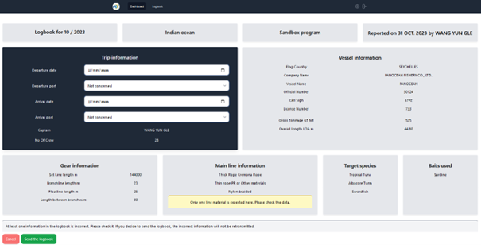

# Longline

## Is there previous trip ?

Once you have uploaded the longline logbook in the platform, the webapp will look for all the previous trip registered in the database for the program entered and the vessel you are submitting. 

- If it's the first time the vessel is entered in this program, you will get to enter a new trip : 

- If previous trips exist, you can choose to create a new one or to continue a previous trip by selecting it

## Construction

You will see an overview of the logbook you are submitting. You have the chance to choose the departure date and port if it is a new trip you are registering. Otherwise it would be already filled with the info of the previous trip you are continuing. 

## Send to Observe

Once you have correctly filled the form and checked the data, you can send the file to observe. If it is correctly filled, the file will be add as you ask. If some issues are noted, the webapp will tell you the error it has encountered and you will have to correct it for add the file to the database.